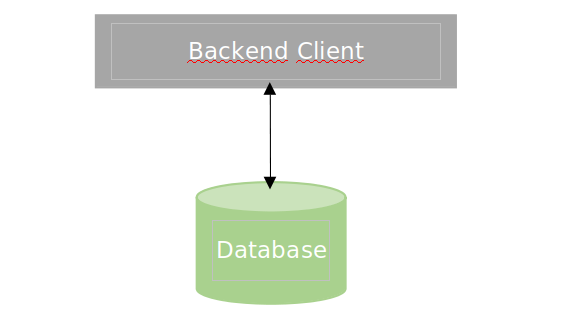
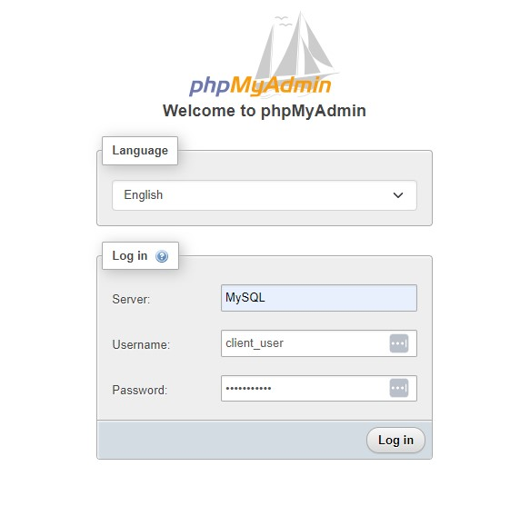
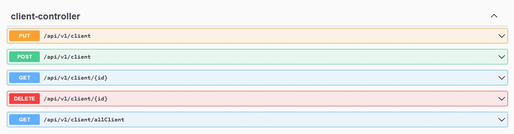

# RestApi Client With SpringBoot
Basic Rest API with Java, Spring Boot using Docker, Spring Data JPA, MySQL, Lombok, and OpenAPI 3.0 (Swagger-UI)

1. Rest API Client
2. Steps to run the application
3. API document

---

# 1. Rest API Client

Rest API that has the functionalities of registering, updating, consulting, and deleting clients.
With the following structure:

A client has the following information:
- Names
- Surnames
- Name of the business name
- Company identifier
- Mail
- Address
- Telephone

It is built with the following technology:
- IntelliJ IDEA
- Spring boot v2.7.5
- Docker
- MySQL

# 2. Steps to run the application

1- Install MySQL and the Client UI PhpMyAdmin using docker-compose
    
2- Create a template from the Docker Compose configuration file that we leave below
        
	version: "3.1"
	 services:
  		mysql:
		image: mysql
		container_name: MySQL
		restart: always
	cap_add:
		- SYS_NICE
	environment:
		- MYSQL_DATABASE=client_db
		- MYSQL_USER=client_user
		- MYSQL_PASSWORD=pass
		- MYSQL_ROOT_PASSWORD=mauFJcuf5dhRMQrxy
        - MYSQL_ROOT_HOST=%
	volumes:
		- mysql-data:/var/lib/mysql
	ports:
		- 5012:3306

	phpmyadmin:
		image: phpmyadmin:5.2.0
		container_name: PhpMyAdmin   
		restart: always
	ports:
		- 5013:80
	environment:
		- PMA_ARBITRARY=1
   
	volumes:
		mysql-data:

3- Save the file locally with the name docker-compose.yml in a directory called <homeusername>/docker/mysql if you are on Unix, or \docker\mysql if you are on Windows.

4- Then, position yourself with a command terminal in the same directory as the file and execute

	docker-compose up -d        
	
> The -d option tells Docker to run the service in the background.

5- To Verify that the MySQL service is active 

	docker ps

6- Server name as DB container name MySQL and other DB credentials

	> Client PhpMyAdmin will be available at 
	
		http://localhost:5013/ 

	> Access Db: 
	
		Server name: MySQL
		DB credentials:	client_user and pass

7- Para detener los contenedores  
	
	docker-compose down

8- Build and Run application

	> mvn spring-boot run it will run application as spring boot application

    or

	> mvn clean install it will build application and create jar file under target directory

    
    Or

	> run main method from ClientApplication.java as spring boot application

# 3. For API document

Using Postman (or any RESTful API testing tool) or API document using OpenAPI 3.0

> Postman
    
	http://localhost:8080/api/v1/client

> OpenAPI 3.0
    
	http://localhost:8080/swagger-ui.html

